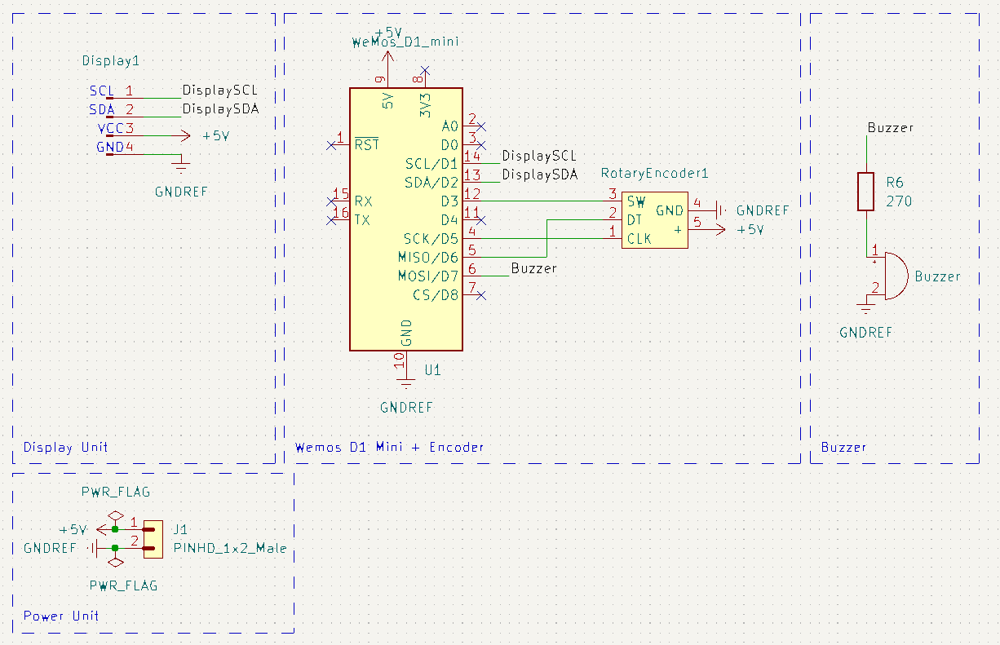
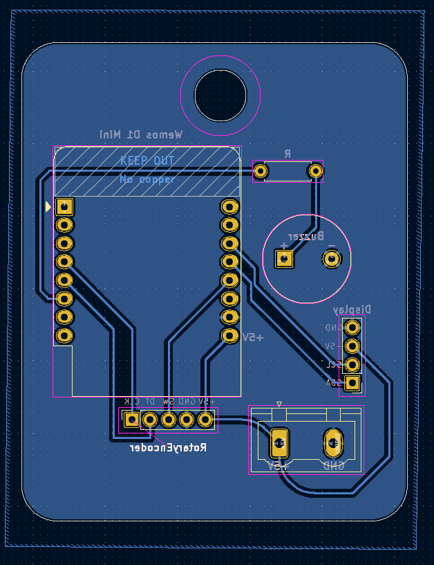

# Sveglia ESP8266
Questa è una sveglia progettata da zero da me

### Firmware
Il firmware della sveglia è scritto in Arduino

### Hardware
L'hardware della sveglia è composto da un ESP8266, un buzzer polarizzato con un passo di 6.6mm, un display LCD 16x4 con un adattatore da parallelo a seriale I2C, un encoder e un alimentatore

### Progettazione hardware
La progettazione dell'hardware è stata svolta nel software KiCad

### Schematica


### PCB


Per la stampa del PCB ho utilizzato il sito [PCBWay](https://www.pcbway.com/)
### Creazione della sveglia
Dopo aver acquisito i componenti necessari e il circuito stampato, serve creare un file include/secrets.h dove bisogna inserire l'SSID e la password del Wifi e dell'hotspot e flashare l'ESP


Es.
```C
// include/secrets.h

#define SECRET_SSID "<SSID>";
#define SECRET_PASSWD "<Password>";
#define AP_PASSWD "<Password>"
```
